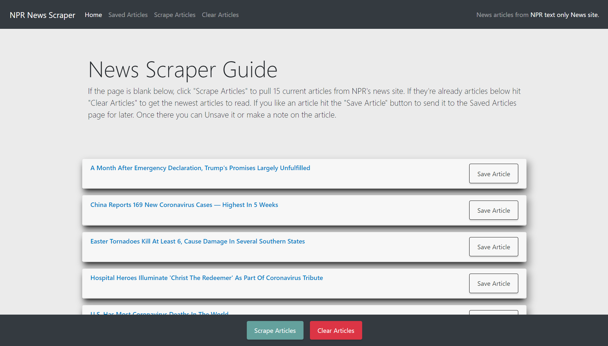

# Mongo-News-Scraper

**Creator**: `Scott Ladd`

**Created on**: `Jan 09th 2020`
- - -

## ABOUT THE APP
This site scrapes news articles from NPRs text only news site. Then it saves them to a MongoDB Atlas database and then renders them 
onto the page for the users to view. You can then save or un-save articles. Once an article has been saved you can add a note which 
all gets saved to the database. 

The front end design was created using HTML, CSS, Javascript, and BootStrap. The backend components comprised of Javascript, Nodejs, 
and these 5 Node packages: [Express](https://www.npmjs.com/package/express) | [Axios](https://www.npmjs.com/package/axios) | 
[Express-Handlebars](https://www.npmjs.com/package/express-handlebars) | [Cheerio](https://www.npmjs.com/package/cheerio) 
| [Mongoose](https://www.npmjs.com/package/mongoose).

- - -

## Deployed Site

This App is deployed on *Heroku* [click Here](https://nprnewsscraper1.herokuapp.com/) to view it.

- - -

## TECHNOLOGIES USED
* BootStrap
* HTML
* CSS
* Javascript
* Nodejs
* MongoDB Atlas
* Node packages:
    * Express
    * Axios
    * Cheerio
    * Express-Handlebars
    * Mongoose
* Git
* GitHub